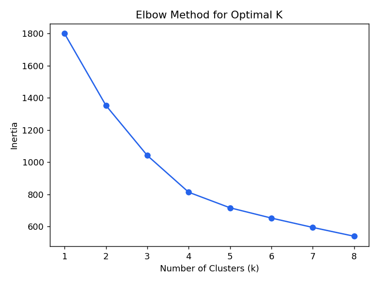
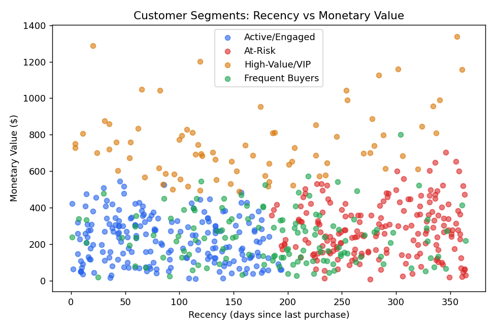
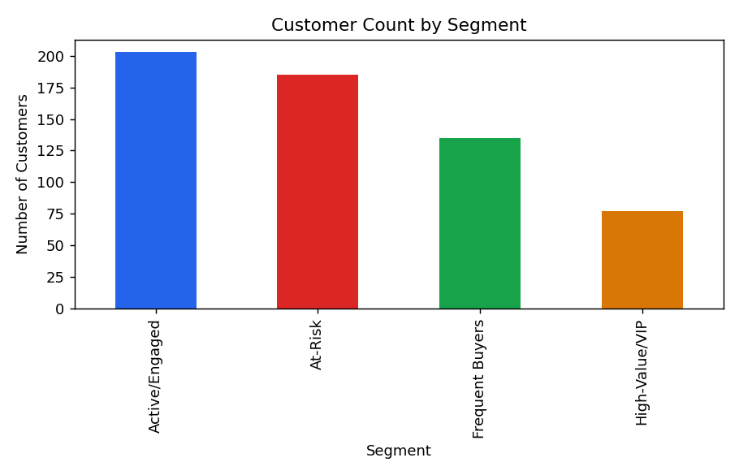

# Customer Segmentation using RFM + K-Means Clustering

An unsupervised machine learning project that segments customers into
actionable groups using **RFM analysis** (Recency, Frequency, Monetary) and
**K-Means clustering**, with marketing recommendations per segment. This
project demonstrates basic ML application for a business use case — a common
ask in Data Analyst / Data Science interviews.

## Tech Stack
- **Python** — Pandas for RFM feature engineering
- **Scikit-learn** — StandardScaler + K-Means clustering
- **Matplotlib** — elbow method plot, segment scatter plot, segment size chart

## Dataset
`data/customer_rfm.csv` — 600 customers with fields:
`CustomerID, Recency (days since last purchase), Frequency (number of purchases), Monetary (total spend $)`

## Methodology
1. **Feature scaling** — standardized Recency, Frequency, Monetary so no
   single feature dominates distance calculations
2. **Elbow method** — used to choose the optimal number of clusters (k=4
   selected based on inertia drop-off)
3. **K-Means clustering** — grouped customers into 4 clusters
4. **Segment labeling** — interpreted each cluster's average RFM profile and
   assigned a business-friendly label

## Segments Identified

| Segment | Recency | Frequency | Monetary | Customers | Description |
|---|---|---|---|---|---|
| **Active/Engaged** | Low | Moderate | Moderate | 203 | Recently purchased, steady spenders |
| **At-Risk** | High | Moderate | Moderate | 185 | Haven't purchased in a long time — churn risk |
| **High-Value/VIP** | Moderate | Moderate | High | 77 | Highest spenders — top priority to retain |
| **Frequent Buyers** | Moderate | High | Moderate | 135 | Buy often, moderate spend per order |

## Visuals

| Elbow Method | Segments (Recency vs Monetary) | Segment Sizes |
|---|---|---|
|  |  |  |

## Business Recommendations
1. **At-Risk segment (185 customers, ~31%)** — launch a win-back campaign
   (email/discount) targeting customers with high Recency before they
   permanently churn.
2. **High-Value/VIP segment** — smallest group but highest spend; build a
   loyalty/VIP program to protect this high-margin segment.
3. **Frequent Buyers** — cross-sell/upsell campaigns, since they already
   purchase often but spend moderately per order.
4. **Active/Engaged** — nurture with regular engagement (newsletters, new
   product alerts) to move them toward Frequent Buyer or VIP status.

## How to Run
```bash
pip install pandas matplotlib scikit-learn
python analysis.py
```
This regenerates all charts, prints the segment summary, and saves the
labeled dataset.

## Project Structure
```
.
├── data/
│   ├── customer_rfm.csv
│   └── customer_rfm_segmented.csv
├── analysis.py
├── cluster_summary.csv
├── elbow_method.png
├── segments_scatter.png
├── segment_sizes.png
└── README.md
```

---
**Author:** Harsh Pandey — Data Analyst | Excel | SQL | Python | Power BI
[LinkedIn](https://linkedin.com/in/harsh-pandey-395a10237)
